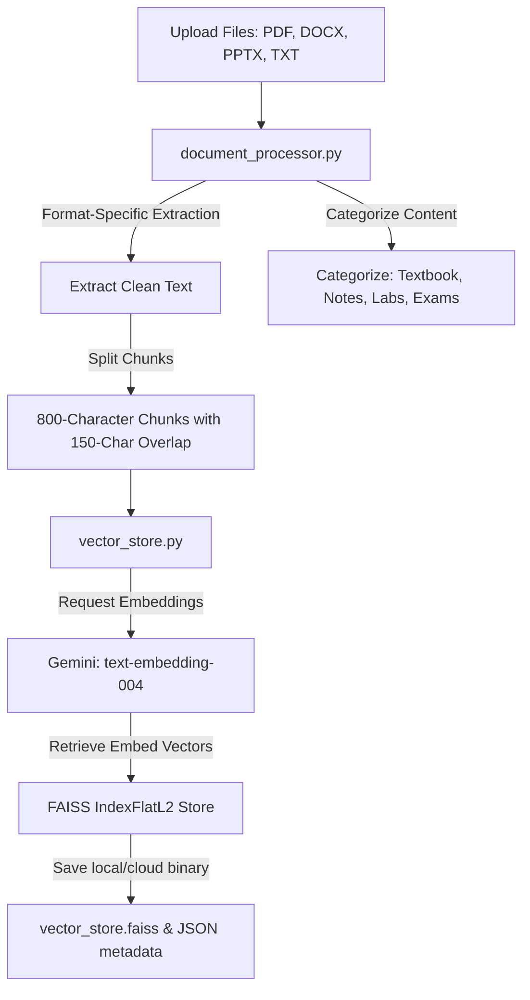
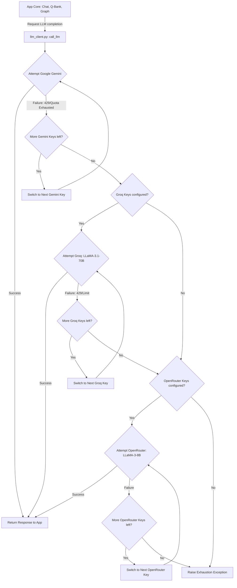

# 🎓 Scholar AI — Smart Subject Guide & Q-Bank Assistant

> **Capabl.in · AI Agent Development Project — Milestone Phase**
>
> An advanced, multi-document academic assistant that generates customized study paths, dynamic question banks, interactive knowledge graphs, and RAG-based explanations. Powered by a robust backend supporting offline-first storage and automatic multi-provider key failover.
**🌐 Live App:** [https://scholar-ai-subject-guide-capabl-techies.streamlit.app/](https://scholar-ai-subject-guide-capabl-techies.streamlit.app/)

---

## 🌟 Key Features

*   **🔒 Secure User Accounts & Email Verification**: Supports individual user registration and login. Secures your account using a verification OTP sent to your email (simulated via terminal fallback if SMTP is absent).
*   **💾 Hybrid Storage Engine (Local + Cloud)**:
    *   *Local Offline Mode*: Saves user metadata, history, settings, and FAISS vector indices safely inside local directories.
    *   *Supabase Cloud Mode*: Integrates with Supabase Auth, database, and buckets for zero-cost permanent cloud deployment.
*   **📖 Adaptive RAG Explanations**: Explains any topic at three custom academic levels:
    *   *Beginner*: Simple language, analogies, no complex jargon.
    *   *Intermediate*: Balanced theory, worked examples, key takeaways.
    *   *Advanced*: Highly technical depth, design choices, trade-offs, and edge cases.
*   **📋 Academic Question Bank (Q-Bank)**: Generates customized MCQs, Short-Answer, Long-Answer questions, and full assessments directly from study materials, complete with answers and explanations.
*   **🕸️ Interactive Knowledge Graph**: Builds visual, node-based maps of topics, subtopics, and logical prerequisites using `vis.js` rendering.
*   **🗺️ Customized Learning Paths**: Maps study progression sequentially (Theory ➡️ Worked Examples ➡️ Mock Quizzes).
*   **⚡ High-Availability Key Rotation & Failover**: 
    *   Accepts comma-separated lists of API keys for each provider to automatically bypass rate-limits and quotas.
    *   Seamlessly fails over down the provider chain: **Google Gemini ➡️ Groq (Free Tier LLaMA) ➡️ OpenRouter (Free Tier LLaMA)**.
*   **📱 Responsive Mobile Layout**: Adapted with collapsible sidebar menus and vertical flow adjustments that render beautifully on smart devices.

---

## 🚀 Quick Start (Local Setup)

### 1. Clone the repository
```bash
git clone https://github.com/capabltechies-bit/Subject_Guide_Vidya_AI.git
cd Subject_Guide_Vidya_AI
```

### 2. Create and activate a Virtual Environment
```bash
python -m venv venv
# On Windows:
venv\Scripts\activate
# On macOS/Linux:
source venv/bin/activate
```

### 3. Install required packages
```bash
pip install -r requirements.txt
```

### 4. Configure environment keys
Copy the template configuration file:
```bash
copy .env.example .env   # macOS/Linux: cp .env.example .env
```
Open `.env` and fill in your keys (e.g. `GOOGLE_API_KEY`). You can specify multiple keys separated by commas for failover.

### 5. Launch the application
```bash
streamlit run app.py
```
Open `http://localhost:8501` to use **Scholar AI**.

---

## ⚙️ How to Configure Failover Keys

Navigate to the **Settings (⚙️ Settings)** tab in the top navigation bar inside the app UI to configure backup keys:
1. **Google Gemini Key(s)**: Main pool of keys used by default.
2. **Groq API Key(s)**: First failover tier. Uses `llama-3.1-70b-versatile` to handle academic tasks for free.
3. **OpenRouter API Key(s)**: Second failover tier. Uses free models (like `meta-llama/llama-3-8b-instruct:free`).

*Note: You can supply a single key or multiple keys separated by commas (e.g. `gsk_key1, gsk_key2`) for rotating and preventing quota blocks.*

---

## 🏗️ Project Architecture

```text
Subject_Guide_Vidya_AI/
├── app.py                  # Streamlit User Interface & Nav Controller
├── llm_client.py           # Multi-provider LLM failover & key rotation client
├── storage_manager.py      # Abstracted storage layer (Local Files vs. Supabase)
├── vector_store.py         # FAISS vector database wrapper & Gemini Embeddings
├── rag_engine.py           # Core synthesis, explanations, and learning path logic
├── question_bank.py        # Question bank generation generator (MCQ/Short/Long)
├── knowledge_graph.py      # Vis.js-ready node & connection builder
├── progress_tracker.py     # Local streak calendar, quiz logs, and dashboard
├── requirements.txt        # Third-party Python dependencies
├── .env.example            # Environment template configuration file
└── README.md               # Application documentation
```

---

## 🧬 System Architecture & Pipelines

Scholar AI consists of three interconnected modular pipelines: **Ingestion & Indexing**, **Hybrid Storage Middleware**, and the **Dynamic LLM Failover & Rotation Chain**.

### 1. Ingestion & Semantic Indexing Pipeline


### 2. Multi-Provider API Failover & Key Rotation Pipeline


### 3. Hybrid Storage Middleware
The database adapter automatically selects the best available storage engine at runtime:
```text
                  ┌────────────────────────┐
                  │   storage_manager.py   │
                  └───────────┬────────────┘
                              │
             Is Supabase configured in env/secrets?
                              │
              ┌───────────────┴───────────────┐
              │                               │
             No                              Yes
              │                               │
              ▼                               ▼
     ┌──────────────────┐           ┌──────────────────┐
     │  Local Database  │           │  Cloud Database  │
     │  (Offline-First) │           │ (Supabase Backend)│
     ├──────────────────┤           ├──────────────────┤
     │ • JSON metadata  │           │ • PostgreSQL DB  │
     │ • Local FAISS    │           │ • Auth tables    │
     │ • SHA-256 salts  │           │ • Storage Bucket │
     └──────────────────┘           └──────────────────┘
```

---

## 🛠️ Technology Stack

| Layer | Tools |
|---|---|
| **Frontend UI** | Streamlit 1.58+ (Custom dark theme styling) |
| **Logic & RAG Engine** | Python 3.11, Google Gemini 2.5, LangChain |
| **Vector Index** | FAISS (In-memory similarity retrieval) |
| **Failover Providers** | Groq (LLaMA 70B), OpenRouter (LLaMA 8B) |
| **Parsers** | pdfplumber, PyPDF2, python-docx, python-pptx |
| **Authentication** | Supabase Auth (Cloud) / Cryptographic Salting (Local) |
| **Database/Storage** | Supabase Storage + PostgreSQL (Cloud) / Local Disk JSON |

---

*Developed for the Capabl.in Subject Guide & QBank AI Agent Development project.*
